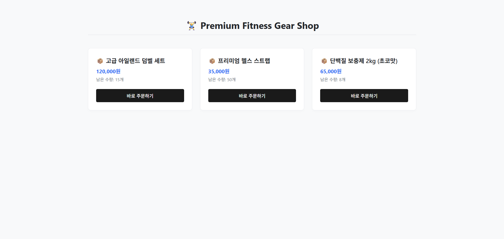

# 🛒 Premium Fitness Gear Shop (E-Commerce Core Engine)



## 📖 Overview
Spring Boot 기반의 쇼핑몰 핵심 도메인 비즈니스 로직과 데이터 정합성, 그리고 조회 성능 최적화를 고려하여 설계한 백엔드 코어 엔진 프로젝트입니다. 단순 기능 구현을 넘어, 대규모 트래픽 유입과 다중 사용자 환경에서의 동시성(Concurrency) 이슈 상황을 가정하고 아키텍처를 고도화하는 데 집중했습니다.

## 🚀 Key Features
- **도메인 주도 패키지 아키텍처 (Domain-Driven Structure)**: 유지보수성과 확장성을 극대화하기 위해 기존의 계층형(Layered) 구조가 아닌 비즈니스 도메인(`User`, `Product`, `Order`) 단위로 패키지를 철저히 격리하여 응집도를 높였습니다.
- **비관적 락(Pessimistic Lock) 기반 동시성 제어**: 선착순 구매 및 한정판 상품 주문 시 발생할 수 있는 재고 불일치(Lost Update) 문제를 원천 차단하기 위해, DB 수준의 `SELECT ... FOR UPDATE` 메커니즘을 도입하여 무결성을 보장했습니다.
- **조회 성능 최적화 (Composite Index)**: 리뷰 데이터 대용량화 시 발생할 수 있는 Full Table Scan을 방지하기 위해 복합 인덱스를 설계하여 정렬 및 필터링 레이턴시를 획기적으로 개선했습니다.
- **글로벌 예외 처리 (AOP 기반)**: 전역 예외 핸들러(`@RestControllerAdvice`)를 구축하여 비즈니스 예외와 시스템 예외를 중앙 집중식으로 제어하고, 클라이언트에게 일관된 표준 에러 응답 객체를 반환합니다.
- **배포 환경 격리 (Multi-Profile)**: 개발 환경(`local`)과 가상 운영 환경(`prod`)의 인프라 설정을 완벽히 분리하고, 실서버의 데이터 안정성을 위해 JPA `ddl-auto` 규칙을 안전하게 제어했습니다.

## 🛠️ Tech Stack
- **Backend**: Java 17, Spring Boot 3.4.2, Spring Data JPA
- **Database**: H2 Database (Local/Test), MySQL (Production)
- **Build Tool**: Gradle
- **Frontend**: HTML5, CSS3, Vanilla JS (Fetch API 연동)

## 📁 Architecture & Directory Structure

```text
src/main/java/com/example/shoppingmall
├── domain
│   ├── user              # 회원 도메인
│   │   ├── controller
│   │   ├── entity
│   │   ├── repository
│   │   └── service
│   ├── product           # 상품 및 리뷰 도메인
│   │   ├── controller
│   │   ├── entity
│   │   ├── repository
│   │   └── service
│   └── order             # 주문 도메인
│       ├── controller
│       ├── entity
│       ├── repository
│       └── service
└── global
    ├── config            # 인프라 및 시스템 설정
    └── exception         # 전역 트래킹 및 예외 처리
📊 Data Architecture (ERD)
주문(Orders)과 상품(Products) 간의 다대다(N:M) 관계를 유연하게 해소하고, 결제 당시의 스냅샷 데이터(주문 시점의 가격, 수량 등)를 영구 보존하기 위해 중간 매핑 엔티티인 주문 상품(Order_Items) 테이블을 설계했습니다.

Users (1) : (N) Orders

Orders (1) : (N) Order_Items

Products (1) : (N) Order_Items

Products (1) : (N) Reviews

▶️ Getting Started (실행 방법)
로컬 환경에서 백엔드 서버를 구동하기 위한 스크립트입니다. (Windows PowerShell 기준)

PowerShell
cd demo
# Java 17 런타임 환경 변수 일시 적용
$env:JAVA_HOME='C:\Program Files\Java\jdk-17.0.2'
$env:PATH="$env:JAVA_HOME\bin;$env:PATH"

# 과거 빌드 찌꺼기 소거 및 스프링 부트 데몬 기동
./gradlew.bat clean bootRun
웹 UI 진입점: 애플리케이션 실행 후 http://127.0.0.1:5500 등 프론트엔드 라이브 서버 포트로 접속하여 동적 렌더링 확인

API 헬스체크: http://localhost:8080/api/products

🔥 Troubleshooting & Architecture Deep Dive
1. 빈번한 충돌 상황에서의 재고 동기화 (동시성 제어)

문제 정의: 인기 상품 주문 시 여러 사용자가 동시에 재고 차감을 요청할 경우, 데이터 갱신 분실(Lost Update) 현상이 발생하여 실제 물리적 재고보다 더 많은 수량이 주문되는 정합성 오류 리스크를 발견했습니다.

해결 알고리즘: 애플리케이션 레벨의 낙관적 락(Optimistic Lock)은 잦은 충돌 발생 시 무수한 롤백 및 재시도 오버헤드를 유발합니다. 트래픽 밀집도가 높은 주문 도메인의 특성을 고려하여, 트랜잭션 진입 시점에 DB 레벨에서 배타적 락을 획득하는 비관적 쓰기 락(Pessimistic Write Lock)을 채택했습니다.

결과: 안정적인 순차 제어를 통해 대용량 동시 요청 상황에서도 마이너스 재고가 절대 발생하지 않는 무결한 데이터 정합성을 달성했습니다.

2. Gradle 빌드 타겟 런타임 버전 불일치 및 랭귀지 서버(LSP) 충돌

문제 정의: 로컬 환경의 다중 JDK 상주 문제로 인해 프레임워크 요구 스펙과 컴파일러 버전이 어긋나며 런타임 크래시 및 IDE 정적 분석(LSP) 마비 현상이 발생했습니다.

해결 방법: 에디터의 작업 영역 컨텍스트 설정을 제어하는 .vscode/settings.json 내부에 java.configuration.runtimes 타겟 경로를 JDK 17 절대 경로로 명시적 매핑하고, LSP 워크스페이스 캐시 소거(Clean Workspace) 알고리즘을 가동하여 인프라 링킹을 완전히 정상화했습니다.

3. 의존성 릴리즈 버전 불일치로 인한 패키지 유실 방어

문제 정의: build.gradle 내 스프링 부트 코어 프레임워크 버전이 Maven Central에 존재하지 않는 버전으로 지정되어, 외부 의존성(BOM) 트리가 통째로 붕괴하고 45건 이상의 패키지 임포트 에러가 유발되었습니다.

해결 방법: 스프링 부트 릴리즈를 검증된 안정화 버전인 3.4.2로 교정하고, 백그라운드 Gradle 데몬 프로세스 리셋(--stop) 및 의존성 강제 재동기화(--refresh-dependencies) 서브루틴을 수행하여 컴파일 안정성을 최적화했습니다.

4. 실서버 데이터 보호를 위한 배포 프로필 분리

문제 정의: 개발 편의성을 위해 사용하던 ddl-auto=create 또는 update 설정이 실서버 환경에 그대로 적용될 경우, 서비스 재구동 시 테이블 드롭 및 데이터 유실이라는 치명적인 인프라 장애를 유발할 가능성이 존재합니다.

해결 방법: application-prod.properties 설정을 별도로 분리하여 격리하고, 실무 운영 환경에서는 데이터 구조적 정합성만 검증하는 validate 또는 none 체제로 옵션을 제어하여 언제든 즉시 배포 가능한 안전한 인프라 환경을 구축했습니다.

📝 Git Commit & Branch Strategy
본 프로젝트는 실무 형상 관리 흐름을 반영하여, 모든 기능 개발을 main 브랜치에 직접 커밋하지 않고 기능 단위의 Feature Branch 전략(feat/기능명, refactor/수정명, fix/버그명)을 수립하여 개발을 진행했습니다. 이를 통해 논리적인 단위의 변경 이력을 투명하게 관리하고 인프라의 안정성을 도모했습니다.